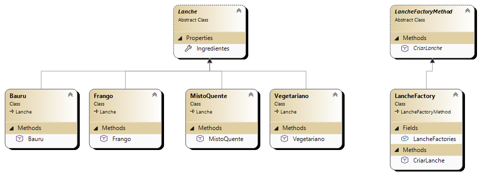

# 📘 Capítulo 04 — Factory Method  
Aplicando o exemplo do Macoratti

🔗 **Referência:**  
https://macoratti.net/19/09/c_factory1.htm

---

## 📌 Visão Geral

O **Factory Method** é um padrão de projeto **criacional** que define uma interface para criação de objetos, mas delega às subclasses a responsabilidade de decidir **qual classe concreta será instanciada**.

Em vez de instanciar objetos diretamente com `new`, o padrão encapsula esse processo, promovendo:

- 🔹 **Desacoplamento** entre quem cria e quem usa o objeto  
- 🔹 **Flexibilidade** para trocar implementações em tempo de execução  
- 🔹 **Extensibilidade** sem alterar o código existente  

---

## 🧠 Ideia Central

O ponto-chave do Factory Method é:

> "Deixe as subclasses decidirem qual objeto criar."

Isso permite que o sistema seja aberto para extensão, mas fechado para modificação (**Princípio OCP**).

---

## ⚙️ Quando usar

Use o Factory Method quando:

- A criação de objetos for complexa ou repetitiva  
- Você quiser evitar acoplamento direto com classes concretas  
- Precisar permitir variações na criação de objetos  
- O tipo do objeto só é conhecido em tempo de execução  

---

##Exemplo

Explicação:

Lanche => representa o "Product" que o método de fábrica (factory method) vai criar
Bauru, Frango, MistoQuente, Vegetariano =>representa o "ConcreteProduct", que implementa a classe Lanche 
LancheFactoryMethod=> representa o "Creator" que declara o método de fábrica (factory method) que retorna um objeto do tipo Product (no nosso exemplo Lanche)
LancheFactoty => Implementa a classe Creator e sobrescreve o factory method para retornar uma instância de um "ConcreteProduct"